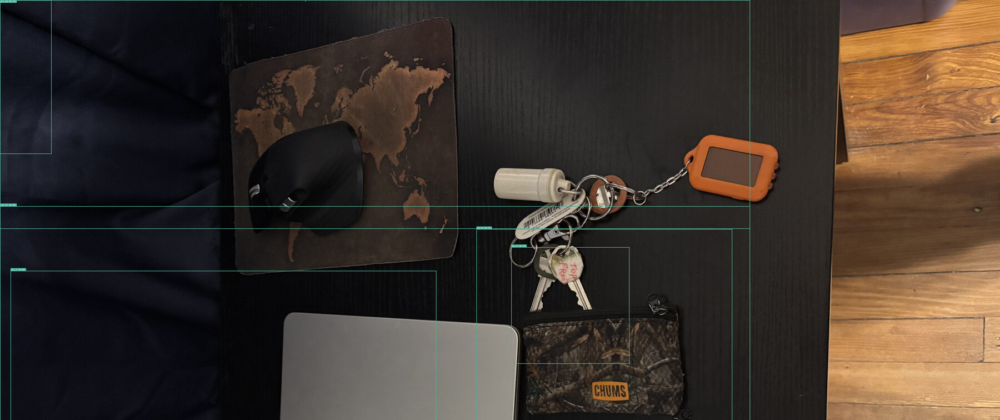
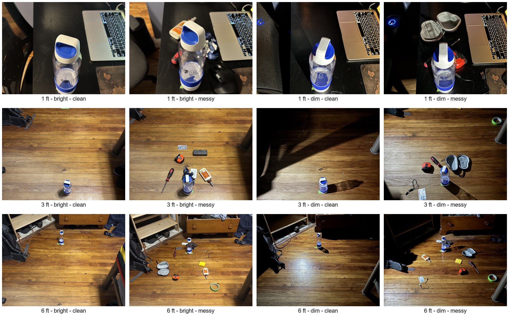

# Spaitra

**A voice-first system that remembers the objects that matter to one person.**

Generic recognition can say *there is a wallet*. Spaitra asks a more personal
question: can a vision system learn which wallet is yours, recognize it again
in a different scene, remember where it was seen, and answer through voice?

Designed for blind and low-vision users, Spaitra connects that personal memory
to spatial narration and a voice-first Teach, Scan, and Ask experience.

I built Spaitra's backend and ML system: the vision pipelines, personal-memory
retrieval and learning path, API and voice state machine, persistence,
evaluation tooling, and GPU deployment. The complete application began as a
team project for the 2026 TSA Software Development event; the mobile client was
shared team work.

## From detection to personal memory

```text
TEACH
label + image
  -> Grounding DINO crop
  -> DINOv3 visual embedding (1,024-d)
  -> [when text-like] PaddleOCR -> confidence-weighted CLIP text (512-d)
  -> normalized 1,536-d representation
  -> SQLite memory (up to 3 prototypes per label)

SCAN
scene -> YOLOE candidate regions
      -> for each crop: the same visual + optional text representation
      -> [when trained] apply the same projection to query + prototypes
      -> cosine retrieval by label
      -> label threshold + optional top-1/top-2 margin
      -> accept or reject
      -> sighting -> deduplicate + spatial order -> [Depth Pro] -> narration

FEEDBACK
correct / wrong result
  -> retain the raw query-memory pair
  -> triplets + hard-negative mining
  -> residual projection head applied at matching time
```

YOLOE only proposes candidate regions. For every crop, Spaitra computes a
1,024-dimensional DINOv3 visual embedding and conditionally adds a
confidence-weighted 512-dimensional CLIP text embedding from PaddleOCR. The
resulting representation is compared with labeled prototypes that the user
previously taught the system.

Cosine retrieval ranks those memories. A threshold gate—and an optional
top-1/top-2 margin—accepts or rejects the best label. Accepted regions are
deduplicated and ordered spatially; Depth Pro can add metric distance before the
backend returns concise narration. Accepted matches also become persistent
sightings for later queries.

## Teach, Scan, Ask

| Mode | What the user can do | What the backend does |
| --- | --- | --- |
| **Teach** | "These are my house keys." | Grounding DINO isolates the named object, then DINOv3 and optional OCR/CLIP create a labeled memory. |
| **Scan** | "What is around me?" | YOLOE proposes regions; personal-memory retrieval identifies taught objects and adds direction, distance, and narration. |
| **Ask** | "Where did I leave my wallet?" or "What does this receipt say?" | Sightings answer memory questions, while OCR and the visual-language path handle object and scene questions. |

Teach is prompt-guided because the user supplies a label. Scan starts without
knowing which remembered objects may be present, so it generates broad
proposals and lets the user's memory index determine which regions matter.

## From speech to action

```text
encoded microphone audio
  -> ffmpeg decode -> mono float32 PCM at 16 kHz
  -> reject undecodable, shorter-than-0.20 s, or near-silent input
  -> state-aware Whisper prompt
       known labels + recent rooms + vocabulary for the current mode
  -> Whisper transcript
  -> deterministic session and command routing
  -> [only when interpretation is needed] Ollama
       canonical search term / focused-item intent / bounded memory tools
  -> exact label, lexical near-match, CLIP label match, or OCR semantic match
  -> ambiguity check
  -> camera, sighting, OCR, VQA, or settings action
  -> Socket.IO result + session state + narration
```

Whisper is part of the interaction pipeline, not a standalone transcription
endpoint bolted onto it. Before decoding, ffmpeg normalizes supported input
formats to the model's 16 kHz mono waveform. The backend builds a bounded
Whisper context prompt from the current session state: idle mode can include
taught labels, recent rooms, and commands such as *scan* or *find*; a pending
confirmation instead emphasizes terms such as *yes*, *no*, *correct*, and
*wrong*. The transcript then enters a Socket.IO state machine that can request
an image or location, focus interaction on one item, or dispatch an action.

Ollama is an intermediary language layer, not the visual matcher. Common
commands and obvious focused-item requests are routed deterministically first.
When wording is less direct, the local model can reduce a phrase to a known
item name, classify a focused-item request, or run a bounded Ask tool loop over
items, sightings, OCR, and descriptions. If Ollama is unavailable or its output
is unusable, the routes continue through deterministic fallbacks.

Name resolution is deliberately layered. It first normalizes labels and checks
exact and substring matches, then permits a Levenshtein distance of at most two
when the label lengths also differ by at most two characters. Depending on the
route, CLIP text similarity can compare the query with stored label embeddings,
and OCR semantic similarity can search embeddings of remembered document text.
Ask refuses to silently choose when its top two different labels are within
0.03 similarity and the transcript does not contain words that distinguish
them; it asks the user to clarify instead.

## Personalization without rewriting memory

Spaitra performs instance retrieval: it tries to distinguish *this specific
object* from other members of the same category.

Teach stores up to three prototypes per label, preserving different views
instead of collapsing them into one averaged vector. OCR is selective because
text can separate receipts, labels, and branded objects, but weak text can also
mislead a matcher. Visual and text slots are normalized separately, and OCR
confidence controls how much the text slot contributes.

Feedback is tied to the raw query and memory embeddings from the corresponding
scan. Correct and wrong relationships form triplets, with the closest negative
selected during hard-negative mining. A small residual projection head learns
the adaptation and is applied to both queries and stored prototypes at matching
time. Its influence ramps with available feedback; the source embeddings in
SQLite are never overwritten.

## System architecture

```text
mobile client
  camera + microphone capture; local TTS, haptics, and UI
       |
       | HTTP + Socket.IO
       v
core service (Flask + Torch)
  voice state + intent routing
  Grounding DINO / YOLOE / DINOv3 / CLIP / Depth Pro / Whisper / VQA
       |                         |
       |                         +--> SQLite memories, feedback, sightings, settings
       |
       +--> OCR service (FastAPI + PaddleOCR)
```

The mobile client captures device input and renders the state it receives. The
backend owns inference, persistence, intent routing, session transitions, and
narration decisions. The [client protocol](docs/CLIENT_PROTOCOL.md) documents
that boundary and the server-driven event stream.

Torch-heavy vision inference and PaddleOCR run in separate environments. Their
dependency and runtime stacks conflicted during integration, so OCR became a
narrow HTTP service rather than sharing the core process. The model registry
also prepares different model sets for Teach and Scan so mutually exclusive
pipelines can trade GPU memory deliberately.

## Implemented backend

- Flask routes for remember, scan, find, ask, feedback, settings, sightings,
  and item management.
- A Socket.IO state machine for Whisper transcription, intent routing,
  onboarding, camera/location prompts, focused-item navigation, and narration.
- SQLite persistence for memory prototypes, OCR metadata, feedback, projection
  weights, user settings, and last-seen sightings.
- Prompt-guided Grounding DINO, prompt-free YOLOE, DINOv3, CLIP, PaddleOCR,
  Depth Pro, and visual-language question routes.
- JSON structured logging, bounded scan caches, benchmark tooling, and
  persistent GPU-container deployment with supervised services.

## Real detector output



This is the proposal stage from a real demo scene. The boxes are deliberately
unlabeled: object identity comes from the post-detection memory path above, not
from the detector itself.

## Controlled evaluation

I built a 120-image instance-retrieval dataset to test more than one favorable
demo scene:

- 10 personal objects;
- 12 conditions per object;
- 3 distances: 1, 3, and 6 feet;
- bright and dim lighting;
- clean and messy backgrounds;
- seed 42, with 6 train and 6 test images per label;
- 60 training and 60 test images, no file overlap, and mixed conditions in
  both partitions.



The harness records top-k retrieval separately from the final acceptance
policy, alongside accepted precision, coverage, false-positive rate,
abstention, condition slices, failure categories, and latency. This separation
shows whether the right memory was absent from the candidate set or retrieved
but handled poorly by the decision gate.

The controlled design and tooling remain useful even though the intended
optimization pass was not completed. See the
[benchmark specification](benchmarks/BENCHMARK_SPEC.md),
[accuracy-tuning methodology](docs/ACCURACY_TUNING.md), and
[hard-case workflow](benchmarks/HARD_CASES.md).

## Code tour

- [Scan pipeline](src/visual_memory/pipelines/scan_mode/pipeline.py) — batched
  proposals and embeddings, selective OCR, retrieval, decisions, depth, and
  narration.
- [Teach pipeline](src/visual_memory/pipelines/remember_mode/pipeline.py) —
  prompt-guided detection, crop refinement, multimodal representation, and
  prototype storage.
- [Combined representation](src/visual_memory/engine/embedding/embed_combined.py)
  — normalized visual/text slots and confidence-weighted OCR contribution.
- [Projection head](src/visual_memory/learning/projection_head.py) and
  [trainer](src/visual_memory/learning/trainer.py) — residual metric adaptation
  and triplet learning.
- [Voice session](src/visual_memory/api/voice_session.py) and
  [Socket.IO routes](src/visual_memory/api/routes/voice_ws.py) — backend-owned
  real-time interaction state.
- [Whisper recognizer](src/visual_memory/engine/speech_recognition/whisper_recognizer.py)
  and [language utilities](src/visual_memory/utils/ollama_utils.py) — state-aware
  transcription context, item-name resolution, and bounded tool interpretation.
- [Full benchmark](src/visual_memory/benchmarks/full_benchmark.py) — fixed
  splits, retrieval traces, operating points, failure analysis, and latency.
- [Architecture](docs/ARCHITECTURE.md) — runtime boundaries, model lifecycle,
  storage, and API flow.

## Repository map

```text
services/core/                Flask + Socket.IO runtime
services/ocr/                 PaddleOCR HTTP service
src/visual_memory/api/        REST, narration, and voice/session flow
src/visual_memory/engine/     model wrappers and multimodal inference
src/visual_memory/pipelines/  Teach and Scan orchestration
src/visual_memory/learning/   feedback and projection-head training
src/visual_memory/database/   SQLite persistence
src/visual_memory/benchmarks/ evaluation and reporting
deploy/runpod/                persistent GPU-container deployment
```

## Run locally

Accept access to the gated DINOv3 and Grounding DINO checkpoints before setup.

```bash
python3 -m venv .venv-core
source .venv-core/bin/activate
pip install -e ".[core]"
hf auth login
python setup_weights.py
```

Create the isolated OCR environment:

```bash
python3 -m venv .venv-ocr
source .venv-ocr/bin/activate
pip install -e ".[ocr]"
python -m services.ocr.run
```

Then start the core service:

```bash
export OCR_SERVICE_URL=http://127.0.0.1:8001/ocr
python -m services.core.run
```

Model-backed execution requires a GPU and local checkpoints. Lightweight test
entrypoints are listed in [Testing](src/visual_memory/tests/scripts/TESTING.md),
with runtime details in [Deployment](docs/DEPLOYMENT.md).

## Limitations

- Semantically similar items remain difficult at distance, under blur, or when
  discriminating text is unreadable. This can be improved with a larger model
  or a LightGlue implementation, but we were limited by inference budget.
- Historical evaluation put the correct label among the top-10 candidates for
  every test query, but final acceptance precision was subpar due to high FP.
- Full execution depends on gated checkpoints and a GPU-capable environment.
- The repository has no source-code license, and its model stack includes`
  component-specific terms tracked in [LICENSES.md](docs/LICENSES.md).

## Project history

This repository continues the backend after the TSA event. The frozen 2026
competition submission remains in the
[original team repository](https://github.com/tsa-softwaredev-26/TSA-soft-dev-backend-2026).
